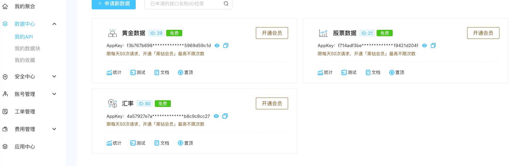
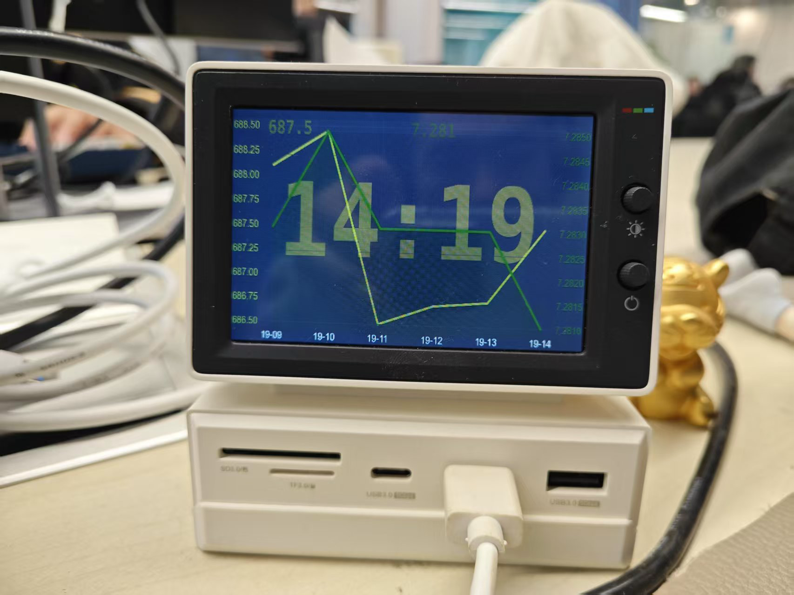
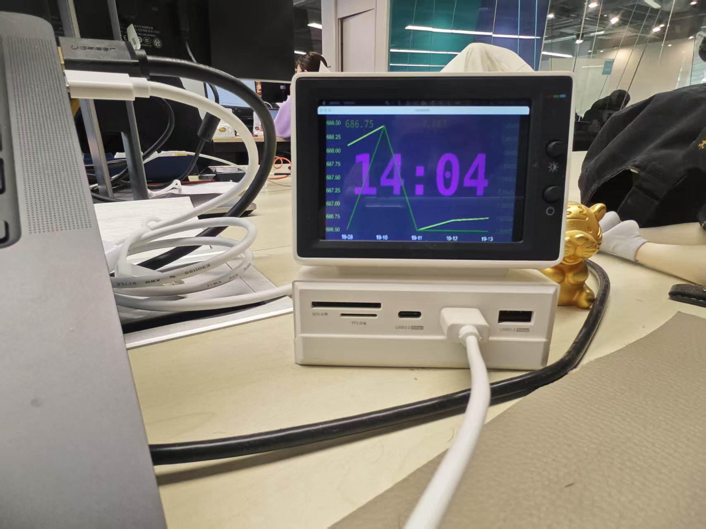

## [中文](doc/README_CH.md)
# Introduction to macDeskTopGadgets

### Project Introduction
The origin of this project is that I bought a new screen to watch videos while slacking off at work.
But most of the time it is idle, and the time is displayed using Apple's built-in time widget.
But that widget is too small and looks uncomfortable. So I decided to make one myself, and I can see the indicators I care about.
In this software, I pay attention to two indicators, one is the exchange rate of the US dollar against the RMB, and the other is the price of gold.
These two data are obtained through the interface provided by  [聚合数据](https://dashboard.juhe.cn/home).
### Interface introduction
If you also want to see these two data, you can register an [aggregate data](https://dashboard.juhe.cn/home) account,
and then get your own interface key. For reference, see the figure:

However, registering this interface requires Chinese ID card information, which may not be available to friends abroad. You need to find the corresponding interface to replace it.

### Display introduction
As shown:

### Development steps
1. Use Apple system
2. Install xcode
3. Initialize the environment and install the following dependencies
    
        brew install pyenv
        export PATH="$HOME/.pyenv/bin:$PATH"
        eval "$(pyenv init --path)"
        eval "$(pyenv virtualenv-init -)"
        pyenv install 3.8.10
        pyenv global 3.8.10
        python -m pip install --upgrade pip
        pip install git+https://github.com/kivy/buildozer.git
        pip install docopt
        pip install sh
        pip install kivy
        pip install kivymd
        pip install Cython==0.29.33
4. After success, you need to execute in the root directory of this project
`buildozer -v osx debug`