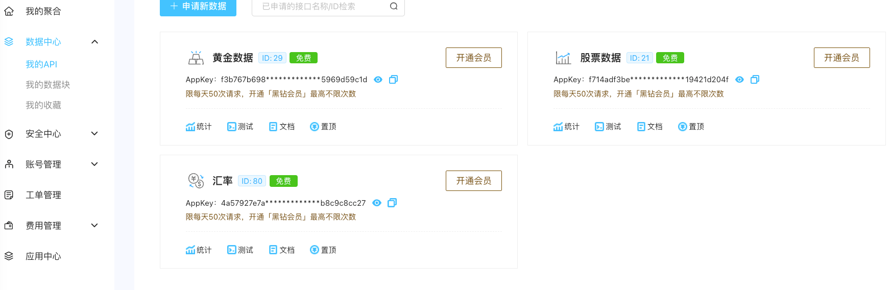
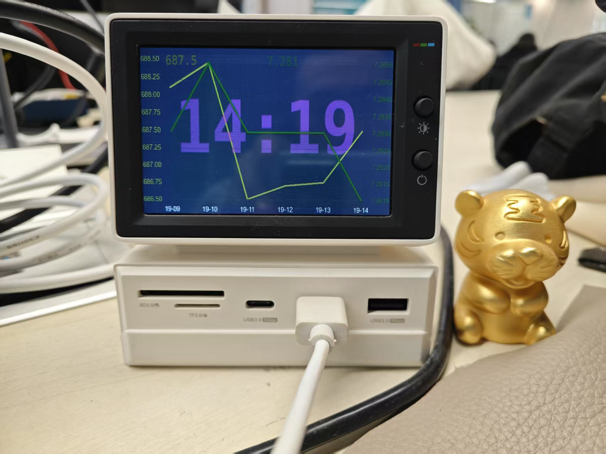
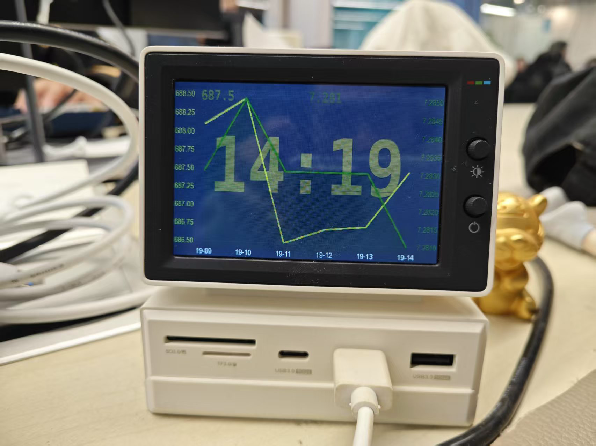
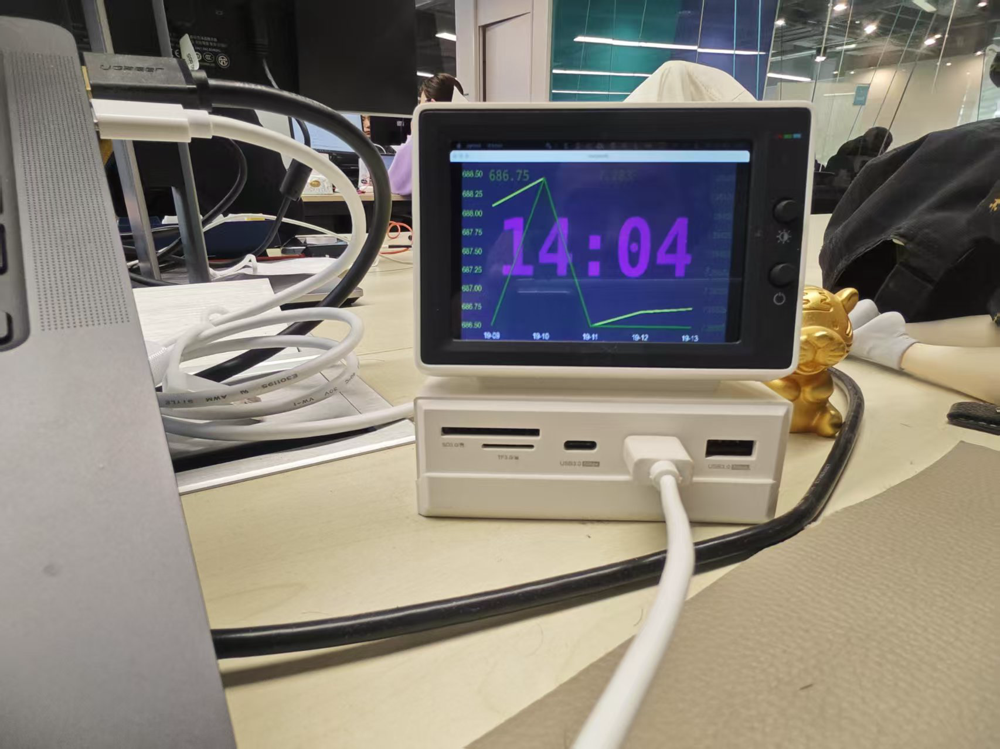

# macDeskTopGadgets 介绍

### 项目介绍
这个项目的起源于我买了一块新的屏幕，是用来摸鱼上班看视频的。
但是大部分时间它是闲置状态的，用苹果内置的时间小插件显示时间。
但是那个小插件太小了，看起来不舒服。所以就打算自己做一个，而且可以看自己关心的指标。
这个软件里，我关注了两个指标，一个是美元兑人民币的汇率，另外一个是黄金的价格。
这两个数据是通过 [聚合数据](https://dashboard.juhe.cn/home) 提供的接口获取的。

### 接口介绍
如果你也想看这两个数据，可以注册一个 [聚合数据](https://dashboard.juhe.cn/home) 的账号，
然后获取自己的接口key。参考如图：

不过注册这个接口需要中国的身份证信息，可能国外的朋友用不了，需要找到对应关心的接口替换。

### 显示介绍
如图：

### 开发步骤
1. 使用苹果系统
2. 安装xcode
3. 初始化环境并安装以下依赖

        brew install pyenv
        export PATH="$HOME/.pyenv/bin:$PATH"
        eval "$(pyenv init --path)"
        eval "$(pyenv virtualenv-init -)"
        pyenv install 3.8.10
        pyenv global 3.8.10
        python -m pip install --upgrade pip
        pip install git+https://github.com/kivy/buildozer.git
        pip install docopt
        pip install sh
        pip install kivy
        pip install kivymd
        pip install Cython==0.29.33
4. 成功后需要在此项目的根目录里执行
`buildozer -v osx debug`

